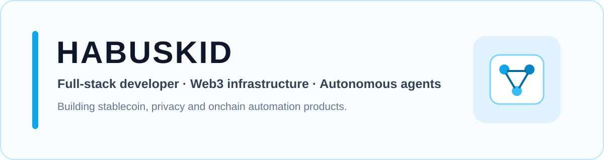

  

  
  
  
  

## About

I build full-stack and onchain products around stablecoin infrastructure, autonomous agents, privacy, payments, and decision systems.

My work is usually built around a real end-to-end path: core logic first, then integration, reliability, interface, and polish. I prefer verifiable integrations and explicit failure states over mock functionality.

## Featured work

<table>
<tr>
<td width="50%" valign="top">

### [Murk](https://github.com/Habuskid/murk)

Spending authority for autonomous agents on Celo. Humans define economic limits in familiar accounting currencies while agents can settle permitted machine purchases through deterministic policy.

**Stack:** Celo, x402, Portal, ERC-8004, Next.js, TypeScript, viem, Neon, Drizzle, Vitest, Playwright

[Repository](https://github.com/Habuskid/murk) · [Live app](https://murk-chi.vercel.app)

</td>
<td width="50%" valign="top">

### [ClauseRoot](https://github.com/Habuskid/clauseroot)

Constitutional upgrade control for autonomous protocols. GenLayer validators evaluate proposed source code against fixed governance rules before an upgrade can finalize.

**Stack:** GenLayer, GenVM, Intelligent Contracts, Transaction Kit, Python, Next.js, TypeScript

[Repository](https://github.com/Habuskid/clauseroot) · [Live app](https://clauseroot.vercel.app)

</td>
</tr>

<tr>
<td width="50%" valign="top">

### [ClosedBell](https://closedbell.vercel.app/desk)

Evidence-first decision desk for stress-testing tokenized-stock trades while the underlying US market is closed. Market evidence stays separate from deterministic portfolio risk calculations.

**Stack:** Bitget Agent SDK, Next.js, TypeScript, Zod, Vitest, Playwright

[Live desk](https://closedbell.vercel.app/desk) · [Demo](https://x.com/Habuskiid/status/2100443885029773700?s=20)

</td>
<td width="50%" valign="top">

### [Sedge](https://github.com/Habuskid/sedge)

Stablecoin copilot for natural-language swaps, bridges, transfers, balances, and transaction workflows across Circle and Arc infrastructure.

**Stack:** Circle App Kit, CCTP, Arc, Next.js, TypeScript, viem, wagmi, Drizzle, PostgreSQL

[Repository](https://github.com/Habuskid/sedge) · [Live app](https://sedge.vercel.app)

</td>
</tr>

<tr>
<td width="50%" valign="top">

### [Blindpot](https://github.com/Habuskid/blindpot)

Confidential no-loss savings protocol with encrypted balances, encrypted winner selection, and privacy-preserving prize claims.

**Stack:** Zama fhEVM, Solidity, Foundry, Morpho, Next.js, TypeScript, viem, wagmi, Neon

[Repository](https://github.com/Habuskid/blindpot) · [Live app](https://blindpot.vercel.app)

</td>
<td width="50%" valign="top">

### [Adyton](https://github.com/Habuskid/Adyton)

Confidential treasury vaults with cryptographic spending-policy enforcement and selective auditor disclosure on Starknet.

**Stack:** Starknet, STRK20, Cairo, Starknet.js, React, TypeScript, Vite

[Repository](https://github.com/Habuskid/Adyton)

</td>
</tr>
</table>

## More things I have built

- [FlightClaim](https://github.com/Habuskid/flightclaim) — deterministic EU261 flight-compensation agent with OKX x402 payments, live telemetry, Redis rate limiting, and Jest tests.
- [Renaiss Intelligence Agent](https://github.com/Habuskid/Renaiss-Intelligence-Agent) — collectible and real-world-asset intelligence terminal using live Renaiss market data and Gemini analysis.
- [ArcDrip](https://arcdrip.vercel.app) — multi-currency payroll streaming, expenses, vesting, and stablecoin flows on Arc.
- [Finda](https://usefinda.vercel.app) — full-stack commerce application built with Next.js, Prisma, authentication, and server-side database workflows.
- [UI Reference Library](https://github.com/Habuskid/ui-templates) — GitHub-native Pinterest reference capture pipeline with Actions, Supabase, palette extraction, and a reusable gallery.
- [Demo Engine](https://github.com/Habuskid) — deterministic product-demo tooling using Playwright, real browser state, FFmpeg, YAML scenes, and local voice tooling.

## Stack

### Languages

  
  
  
  
  
  
  
  

### Frontend and product

  
  
  
  
  
  

### Backend, data and automation

  
  
  
  
  
  
  
  
  
  
  

### Onchain and agent infrastructure

  
  
  
  
  
  
  
  
  

  
  
  
  
  
  
  
  
  
  
  
  

### Testing and delivery

  
  
  
  
  
  

## Contribution activity

<picture>
  <source media="(prefers-color-scheme: dark)" srcset="https://raw.githubusercontent.com/Habuskid/Habuskid/output/github-contribution-grid-snake-dark.svg">
  <source media="(prefers-color-scheme: light)" srcset="https://raw.githubusercontent.com/Habuskid/Habuskid/output/github-contribution-grid-snake.svg">
  
</picture>

## Connect

- X: [@Habuskiid](https://x.com/Habuskiid)
- Portfolio: [habuskid.vercel.app](https://habuskid.vercel.app)
- GitHub: [github.com/Habuskid](https://github.com/Habuskid)
